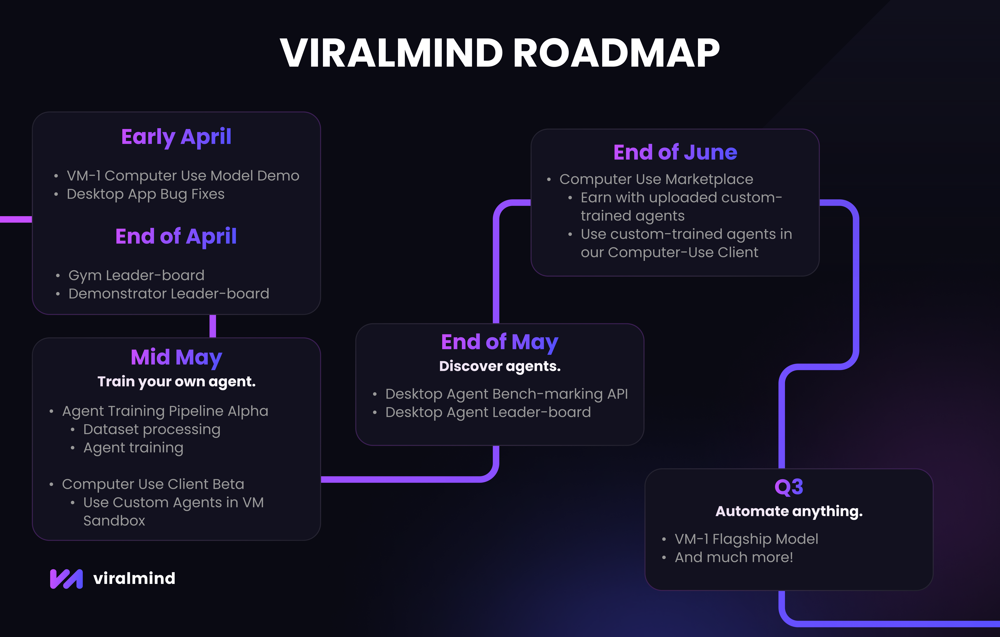

# Roadmap

<figure><figcaption></figcaption></figure>

## **Early April**

* **VM-1 Computer Use Model Demo** - The first public unveiling of the **VM-1 alpha**, our groundbreaking agent designed to handle real-world computer tasks!
* **ViralMind Desktop Bug Fixes -** We’re continuously polishing the **ViralMind Desktop app** to make it more reliable and intuitive. Expect:
  * Smoother navigation and user interfaces.
  * Fixes for crashes or glitches reported by early users.
  * Enhanced customizability and privacy settings.

## **End of April**

* **Gym Leaderboard** Introducing the **Training Gym Leaderboard**—a fun, competitive way to see how your AI agents stack up! This feature will:
  * Rank agents based on **speed**, **accuracy**, and **task complexity** (e.g., how fast an agent can complete a task in Excel).
  * Highlight top performers weekly with badges and shoutouts.
  * Inspire users to tweak their agents and climb the ranks!
* **Demonstrator Leaderboard** - A companion ranking for the top **training demonstrators** in the community. Here’s what you’ll see:
  * The users with the highest task scores and $VIRAL earnings at the top.
  * Highlight top performers weekly with badges and shoutouts.

## **Mid-May**

* **Desktop App Training Pipeline Alpha** - The **Alpha release** of our training system lets you transfer demonstration data from the Forge into computer use agents. Here’s how it works:
  * **Process Datasets**: Forge data is processed into training-ready datasets with the click of a button.
  * **Agent** **Training**: Agents are trained on your datasets using our state of the art training infrastructure.
  * **Exporting**: Release your trained agent to the public for integration with our **Computer Use Client**.
* **Computer Use Client Beta** - Our **Beta desktop automation software** brings your trained agents to life! Key features include:
  * **Local Execution**: Run agents on your own machine—no cloud required (perfect for privacy buffs).
  * **Virtual Machine Support**: Test agents in a sandboxed VM to safely experiment with tasks like coding, gaming automation, or market research.
  * Example use case: Ask an agent trained on food delivery apps to order you the best pizza in town — all hands-free!

## **End of May**

* **Agent Benchmarking Leaderboard -** Time to put your agents to the test! This leaderboard will:
  * Evaluate agents on **standardized benchmarks** (e.g., completing an Excel task in the allotted time frame).
  * Score them on **efficiency**, **error rate**, and **versatility** across tasks.
  * Offer prizes or $VIRAL token rewards for top performers each month.
  * Provide detailed stats so you can see where your agent excels—or needs a tune-up.

## **End of June**

* **Computer Use Marketplace -** The **Marketplace** turns your AI skills into profit and simplifies task automation for everyone:
  * **Sell Your Agents**: List your custom-trained agents and earn a commission per sale.
  * **Buy Pre-Trained Agents**: Skip the training and grab ready-made solutions — like an agent that auto-edits podcasts or schedules meetings.
  * **Rating System**: Community reviews and ratings ensure you’re buying or selling quality.
  * Bonus: A portion of each sale supports $VIRAL ecosystem growth!

## **Q3**

* **VM-1 Flagship Model Release -** The big moment — **VM-1** will launch as our flagship computer use model.
* **And Much More**
  * Stay tuned for updates as we push the boundaries of AI automation!
